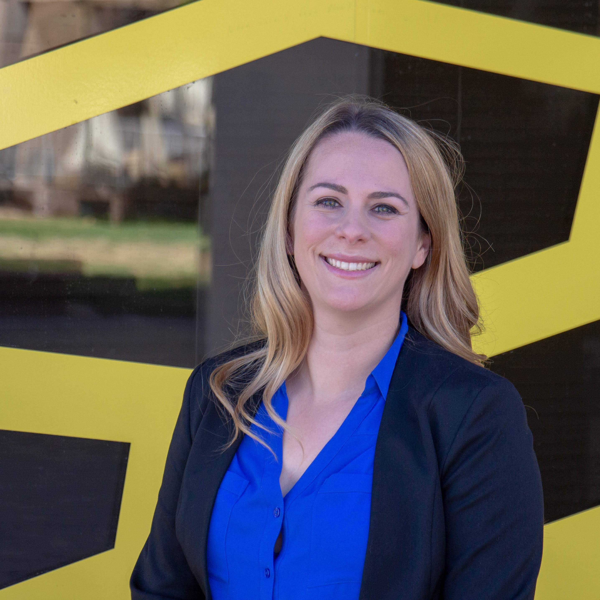

# Welcome

## Career Objectives

I am pursuing a new career in software development. I discovered after 5 years of teacher that my real passion lies in helping others problem solve. While teaching gave me some satisfaction in this, I didn’t feel as though the logic-oriented side of my brain was being challenged enough. This is what led me to the Java/Android DeepDive Coding Bootcamp and my interest in becoming a software developer. 

##Technical Toolbox:

Programming Languages	:Java, SQL
Markup and Style Languages:	XML, HTML, Markdown, CSS
Frameworks & Libraries:	Java & Android standard libraries, JavaFX, Room, Hibernate, Spring & Spring Boot       
Development Environment & Tools:	IntelliJ IDEA, Android Studio, Git
Operating Systems:	Windows, MacOS, iOS, Android
Collaboration Platforms:	GitHub, Google Suite (Docs, Sheets, Mail, Drive, Presentation, Calendar)
Applications:	Microsoft Office (Word, PowerPoint, Excel)

## Current Projects

* [A-Maze-Ballz](https://github.com/edubois9119/a-maze-ballz) 
  *	Created a maze game app that requires the user to navigate a ball through a randomly generated maze, by tilting the device or - optionally - using the touch screen. Selecting higher levels of difficulty results in the generation of increasingly complex mazes.

* [Dominion App](https://dominion-game.github.io/)
  * Created a mobile version of the board game Dominion, a deck-building game for 2+ players. The Dominion app seeks to recreate the game experience by using a visual interface imitating the physical setup of the card game and uses Android, Android Room, Spring, Spring Boot and Hibernate technologies

## Education

Central NM Community College (CNM), STEMulus Center, Albuquerque, NM
Deep Dive Coding Bootcamp						Expected Dec. 2019
Certificate of Completion- Java/Android Developer
  Currently enrolled in a 12-week Java/Android Bootcamp.This program consists of 750 hours of up to date Java/Android development education including: immersive, hands-on development of a personal android project and working with a simulated development team to create a Capstone project.

California Polytechnic State University, San Luis Obispo, CA
MS of Agricultural Education							June 2016
    Related Coursework in Agricultural Science and Education

## Previous Employment 

Previous Employer(s)
Science Teacher								Aug 2014- June 2019	
* Facilitated student created websites and blogs
* Regularly used Google Apps for Education
* Maintaining student databases and records
* Created engaging and interactive presentations
* Incorporated Kahoot and other review games

## Links

* [GitHub Repositories](https://github.com/edubois9119)

* [LinkedIn](https://www.linkedin.com/in/erica-dubois-90b171187/)

